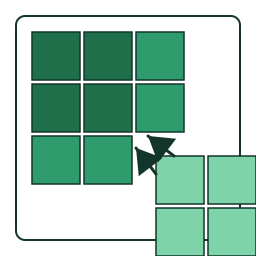

# FracFixD: a native-D rewrite of FracFixR — fast compositional fractional fixup and differential proportion testing for RNA fractionation data

> **A native-D, single-binary, GUI-and-CLI compositional statistics
> tool for fractionated RNA sequencing assays, built from the ground
> up for *pipeline-scale* throughput.**
> Run the same NNLS-based fraction recovery and beta-binomial
> differential-proportion testing as FracFixR — but as a single
> portable executable that processes 100k-transcript experiments in
> seconds, integrates as a Snakemake / Nextflow step without an R
> install, and ships a GTK3 GUI for interactive exploration when you
> want one.

<p align="center">
  
</p>

<p align="center">
  <a href="https://github.com/Arnaroo/FracFixR/releases"></a>
  <a href="LICENSE"></a>
  
  
</p>

---

## What FracFixD is for

FracFixD is the binary-distribution sibling of
[**FracFixR**](https://github.com/Arnaroo/FracFixR), the R package
that implements compositional fixup for fractionated RNA-seq
experiments (polysome profiling, subcellular fractionation,
RNA-protein complex isolation, any assay that splits one sample
into several library-prepped fractions).  Where FracFixR is the
canonical, open-source, R-native reference, FracFixD is the same
mathematics — re-implemented in D for native parallel throughput
— packaged as a single self-contained executable.

FracFixD targets four audiences that an R-only release serves
less well:

1. **Pipeline authors** building Snakemake / Nextflow / SLURM
   workflows who want a *single dropped-in binary* with no R
   install, no library version negotiation, no `renv.lock`
   shipping alongside the workflow.  The static CLI is a 1.9 MB
   executable that produces the same proportion fits and
   differential-proportion p-values FracFixR does.
2. **High-throughput / cluster users** running ten-thousand to
   million-transcript experiments where the R baseline is too
   slow.  FracFixD uses the same NNLS / GLM / beta-binomial Wald
   stack but routes the inner numerical loops through LDC-LLVM-
   compiled SIMD code, with `znver2` and `broadwell` microarch-
   tuned release builds.
3. **Bench scientists who want a GUI** without installing R,
   RStudio, BiocManager dependencies, and a stack of CRAN
   packages.  Double-click the binary and the GTK3 multi-tab
   interface walks you through count loading, fractional fixup,
   diff-prop testing, and volcano plotting.
4. **Statisticians comparing alternative tests** for
   over-dispersed fractional data.  FracFixD ships seven
   diff-prop test backends (binomial-GLM LRT, logit-Wald,
   beta-binomial Wald, Rao score, HC0 / HC3 sandwich, quasi-
   binomial), three FDR procedures (BH / BY / Storey), four
   posterior-shrinkage estimators (Gaussian / apeglm / ashr),
   and Bayesian / bootstrap / Wald confidence intervals on the
   recovered proportions.

If you work with **polysome profiling, subcellular fractionation,
nuclear / cytoplasmic RNA, monosome / disome / oligosome
profiles, ribosome occupancy, RNA-protein complex isolation,
sucrose-gradient fractions, or any other compositional RNA
assay** and you've ever wished FracFixR was faster, or shipped
as a single binary instead of a CRAN package, FracFixD is built
for you.

---

## Why FracFixD is different (vs FracFixR)

| Capability | What it means in practice |
|---|---|
| **Native-D, LDC-compiled inner loops** | NNLS, IRLS (binomial GLM), L-BFGS-B (beta-binomial), and the Wald / score / sandwich variants all run as compiled native code with `-O3 --flto=full -boundscheck=off`.  Per-transcript fits are dispatched across CPU cores via `std.parallelism.taskPool`. |
| **Microarchitecture-tuned release builds** | Three Linux x86_64 binaries ship out of the box: `znver2` (Zen 2 Ryzen 3000/4000/5000), `broadwell` (Intel 5th-gen onward), and `generic` (x86-64-v3 baseline; runs on most 2013+ CPUs).  Pick the one that matches your cluster's silicon. |
| **Single binary, GUI + CLI** | One executable.  Run with no arguments → GTK3 GUI launches.  Run with `--cli` or any subcommand → headless console mode.  Same code path under the hood. |
| **Self-contained static CLI** | The `fracfixd-cli-linux-x86_64-static` artefact links the D runtime statically and depends only on libc + libblas at runtime.  1.9 MB.  Perfect for container images and HPC node-locals. |
| **Caching pipeline** | `fracfix --cache-fits FILE.cache` saves the per-replicate NNLS fits + proportions matrix; `diffprop --from-cache FILE.cache` skips the entire fixup step.  Same statistical output, ~10× faster re-runs when you only need to vary the diff-prop knobs. |
| **Native binary proportions format** | `--out-proportions-bin FILE.bin` writes the FFXD1BIN packed-double format; `diffprop --norm FILE.bin` parses it ~30× faster than the equivalent TSV. |
| **Deterministic step rule for SIMD reproducibility** | `--bb-step-rule deterministic` opts the beta-binomial fitter into a basin-desensitised L-BFGS-B variant with pure-double special functions — reproducible across CPU microarchitectures and SIMD widths. |
| **Native SVG volcano plots** | `fracfixd plot --diff FILE --out FILE.svg` renders a publication-grade volcano in SVG 1.1 (renderer-stable across librsvg, Inkscape, Firefox).  Optional `--r-script FILE.R` emits an EnhancedVolcano-style ggplot reproduction script. |
| **Compositional QC built-in** | `--qc on|strict` runs intercept-stability + per-replicate κ(X) checks before the fits commit; `--qc-report FILE` writes a TSV diagnostic alongside the proportions. |
| **No telemetry, no cloud, no account** | FracFixD is a desktop / CLI application.  It does not phone home.  All inputs and outputs are local files. |

FracFixR remains the **reference** implementation and the open-
source, scientifically-citeable form of the method.  FracFixD is
its production binary sibling.  See the
[**Statistical equivalence**](#statistical-equivalence) section
below for the numerical-agreement contract.

---

## What you get out of the box

### Subcommands

- **`fracfixd fracfix`** — compositional fixup (proportions
  recovery + lost-fraction estimation).  Produces a self-
  describing proportions TSV / `.bin` you can hand to any
  downstream tool.
- **`fracfixd diffprop`** — differential-proportion testing
  between two or more conditions, with the full battery of
  asymptotic and permutation tests.
- **`fracfixd plot`** — volcano SVG renderer with optional R
  reproduction script.
- **`fracfixd help [SUBCOMMAND]`** — detailed per-subcommand help
  and changelog.

### Statistical tests (`--test`)

`glm` (binomial-GLM LRT, canonical) · `logit` (binomial GLM
Wald) · `wald` (beta-binomial regression Wald) · `score` (Rao
score test, robust under separation) · `sandwich-hc0`,
`sandwich-hc3` (White / MacKinnon-White heteroskedasticity-
consistent SEs, optional clustering) · `quasi` (quasi-binomial
Wald with Pearson φ inflation).

### Multi-condition tests (`--multi-cond`)

Global LRT (df = K-1) or joint Wald χ² across K ≥ 2 conditions,
with optional per-pair contrasts (`--contrast A:B,A:C,...`).

### Dispersion modelling (`--dispersion`)

`global` (single φ̂ from the data) · `trend` (count-binned
mean-φ trend) · `per-transcript` (each transcript's own φ̂).
Optional Bayesian shrinkage prior on log-φ
(`--phi-prior trended` with df controlled by `--phi-prior-df`).

### Multiple-testing correction (`--fdr`)

`bh` (Benjamini-Hochberg) · `by` (Benjamini-Yekutieli) ·
`storey` (single-λ q-values, less conservative when π₀ < 1).
Optional independent filtering (`--filter-by mean|count
--filter-quantile F`) to reclaim power on low-count tails.

### Posterior shrinkage (`--shrink`)

`normal` (empirical-Bayes Gaussian prior, τ² from the data) ·
`apeglm` (Cauchy-prior posterior mode; Zhu, Ibrahim & Love
2018) · `ashr` (adaptive-shrinkage scale mixture; Stephens
2017).  Writes both the raw and shrunken log₂FC columns.

### Robust NNLS (`--nnls`)

`plain` (default; v1.5.x bit-identical reference) · `ridge`
(L₂-regularised; `--ridge-lambda`) · `auto` (κ(X)-triggered
fallback; `--nnls-auto-trigger`).

### Permutation p-values (`--permutation`)

Per-transcript label-permutation reference for the asymptotic
p-values.  Cluster-friendly: a `splitmix64` mixer makes the
per-transcript stream independent of `--threads`.  Gate
expensive permutation work to low-count rows via
`--permutation-min-count`.

### Resumable pipeline (`--cache-fits` / `--from-cache`)

Save the FracFix step's per-replicate fits and proportions
matrix to a `.cache` file once; reuse from any number of
downstream `diffprop` invocations.

### Output formats

**Proportions**: TSV (default; matches FracFixR `write.table` byte
shape) or FFXD1BIN packed-double (`--out-proportions-bin`).
**Differential results**: TSV with raw + shrunken log₂FC,
asymptotic + permutation p-values, padj, phi-hat columns.
**Plots**: SVG 1.1 volcano (`fracfixd plot`); optional R
reproduction script.

### Logging / scheduling

`--log FILE` (timestamped log file) · `--verbosity tXlY` (split
terminal / log levels) · `--quiet` / `--verbose` shorthands ·
`--progress` (INDEGRA-format stage markers on stderr,
independent of `--quiet`).
`--threads N` · `--chunk N` · `--ram-cap-gib X` ·
`--in-core` / `--chunked` (scheduler overrides).

---

## Statistical equivalence

FracFixD is verified against FracFixR on every release via an
in-tree equivalence harness:

- **Default-flag `--test glm` / `--test logit`**: Spearman
  ρ(log₂FC) ≥ 0.99 and ρ(−log₁₀ p) ≥ 0.95 on the standard
  synthetic fixtures.
- **Default-flag `--test wald`**: same Spearman targets; the
  `|Δlog₁₀ p|` envelope is 0.20 because the beta-binomial MLE
  has a wider convergence basin than the GLM LRT route.
- **`--bb-step-rule deterministic`**: experimental opt-in mode
  (basin-desensitised L-BFGS-B + pure-double special
  functions).  Reproducible across CPU microarchitectures and
  SIMD widths; classic mode (default) is bit-identical to
  v1.5.x.

The reference R outputs are produced from a fresh
`devtools::install_github("Arnaroo/FracFixR/CRAN")` per equivalence
run so the harness *notices* if upstream FracFixR changes its
behaviour.

---

## Quick install (Linux)

Pick the binary that matches your CPU and drop it on your
`$PATH`:

```bash
# AMD Zen 2 / 3 / 4 (Ryzen 3000+, EPYC Rome / Milan / Genoa)
curl -fsSL https://github.com/Arnaroo/FracFixR/raw/master/FracFixD/bin/fracfixd-linux-znver2-x86_64 \
     -o /usr/local/bin/fracfixd && chmod +x /usr/local/bin/fracfixd

# Intel Broadwell or newer (i5 / i7 5th-gen+, Xeon E5 v4+)
curl -fsSL https://github.com/Arnaroo/FracFixR/raw/master/FracFixD/bin/fracfixd-linux-broadwell-x86_64 \
     -o /usr/local/bin/fracfixd && chmod +x /usr/local/bin/fracfixd

# Generic x86-64-v3 baseline (runs on most 2013+ CPUs)
curl -fsSL https://github.com/Arnaroo/FracFixR/raw/master/FracFixD/bin/fracfixd-linux-generic-x86_64 \
     -o /usr/local/bin/fracfixd && chmod +x /usr/local/bin/fracfixd

# Static CLI (no GUI, minimal runtime deps; ideal for containers / HPC)
curl -fsSL https://github.com/Arnaroo/FracFixR/raw/master/FracFixD/bin/fracfixd-cli-linux-x86_64-static \
     -o /usr/local/bin/fracfixd-cli && chmod +x /usr/local/bin/fracfixd-cli
```

Verify the download:

```bash
sha256sum -c <(curl -fsSL https://github.com/Arnaroo/FracFixR/raw/master/FracFixD/bin/SHA256SUMS)
fracfixd --version
```

**GUI requirements** (only needed for double-click / no-flag
launch): GTK 3 (`libgtk-3-0`) at runtime.  Install via your
distro's package manager:

```bash
# Arch / Manjaro
sudo pacman -S gtk3

# Ubuntu / Debian
sudo apt-get install libgtk-3-0

# Fedora / RHEL
sudo dnf install gtk3
```

The CLI mode does not require GTK — `fracfixd --cli` and
`fracfixd-cli-linux-x86_64-static` run on headless hosts with
no GUI libraries installed at all.

### macOS (arm64)

A native arm64 `.dmg` is shipped alongside the Linux binaries:

```bash
# Download the .dmg
curl -fsSL https://github.com/Arnaroo/FracFixR/raw/master/FracFixD/bin/FracFixD-2.0.0-macos-arm64.dmg \
     -o FracFixD-2.0.0-macos-arm64.dmg

# Verify (compare against SHA256SUMS)
shasum -a 256 FracFixD-2.0.0-macos-arm64.dmg

# Mount + install
open FracFixD-2.0.0-macos-arm64.dmg
# Drag FracFixD.app into the Applications symlink.
```

First launch: right-click `FracFixD.app` → Open to clear the
one-time Gatekeeper confirmation (the binary is ad-hoc signed,
not Developer-ID notarised).  Or clear the quarantine flag from
Terminal:

```bash
xattr -dr com.apple.quarantine /Applications/FracFixD.app
```

For CLI / pipeline use, a relocatable tarball is also shipped:
`fracfixd-2.0.0-macos-arm64.tar.gz`.  Extract and call
`./fracfixd-macos/bin/fracfixd-launcher.sh --cli ...` from any
location.

### Windows (x86_64)

A pre-built Windows binary is **planned** for a follow-up
release.  Until it lands, users with access to the source tree
can build their own following the step-by-step recipe in
[`docs/BUILD_WINDOWS.md`](docs/BUILD_WINDOWS.md) — the same
recipe produces both a portable ZIP and an Inno Setup `.exe`
installer with all GTK 3 + OpenBLAS / LAPACK / gfortran DLLs
bundled.  Source-tree access is by request (see
[*Source code*](#source-code)).

---

## Quick start (CLI)

Minimal pairwise differential-proportion run, GLM-LRT route:

```bash
# 1. Fractional fixup: recover proportions from raw fraction counts
fracfixd fracfix \
    --counts counts.tsv \
    --annot  annotation.tsv \
    --out    proportions.tsv

# 2. Differential testing between two conditions
fracfixd diffprop \
    --counts     counts.tsv \
    --annot      annotation.tsv \
    --norm       proportions.tsv \
    --conditionA WT --conditionB KO \
    --type       Fraction1 \
    --test       glm \
    --out        diffprop.tsv

# 3. Volcano SVG
fracfixd plot \
    --diff diffprop.tsv \
    --out  volcano.svg
```

`counts.tsv` is a transcript × sample integer matrix; `annotation.tsv`
maps each sample column to its `(Condition, Replicate, Fraction)`
triplet.  Both formats are documented under `fracfixd help fracfix`.

Multi-condition global LRT with per-pair contrasts (Session 22+):

```bash
fracfixd diffprop \
    --counts counts.tsv --annot annotation.tsv --norm proportions.tsv \
    --multi-cond \
    --conditions WT,KO,RESCUE \
    --multi-cond-test lrt \
    --contrast WT:KO,WT:RESCUE \
    --type Fraction1 --test wald \
    --out diffprop.tsv
```

Pipeline-style invocation with caching, parallel threads,
progress markers, and the static CLI binary:

```bash
fracfixd-cli fracfix --counts counts.tsv --annot annotation.tsv \
    --out-proportions-bin props.bin \
    --cache-fits fits.cache \
    --threads 16 --progress --quiet

fracfixd-cli diffprop \
    --counts counts.tsv --annot annotation.tsv \
    --from-cache fits.cache \
    --conditionA WT --conditionB KO --type Fraction1 \
    --test wald --fdr storey --shrink apeglm \
    --out diffprop.tsv \
    --threads 16 --progress --quiet
```

See `fracfixd help diffprop` for the full flag inventory
(roughly 50 options grouped by purpose — testing, dispersion,
FDR, shrinkage, permutation, QC, output formatting, logging).

---

## Known limitations in v2.0.0

These are documented up front so you can decide whether v2.0.0
fits your workflow.

- **Linux x86_64 and macOS arm64 only.**  Windows x86_64
  binary is planned for a follow-up release; build instructions
  are shipped today and Seva is producing the binary.
- **GUI is Linux-only this release.**  CLI mode works on every
  platform the binaries are built for; the GTK3 GUI only ships
  for Linux in v2.0.0.
- **`--bb-step-rule deterministic` ships EXPERIMENTAL.**  On the
  N=1000 dev fixture it reaches log₂FC Spearman 0.98 (vs the
  classic 0.99+ target) — the residual gap is a small number of
  φ-boundary transcripts where the deterministic kernel finds a
  legitimately different (often better) MLE than classic.
  Default classic mode is bit-identical to v1.5.x.
- **Runtime dependencies** are the system OpenBLAS / LAPACK /
  gfortran / GTK3.  Available on every standard Linux install
  with R, scientific Python, or GNU Octave already present.
  The static CLI variant drops the LAPACK / GTK3 deps.
- **No Hi-C / multi-omic extensions.**  FracFixD is single-purpose:
  compositional fractional fixup + differential-proportion
  testing.  For genome-browser visualisation pair it with
  [VX](https://github.com/Arnaroo/VX); for full RNA-seq quant
  pair it with salmon / kallisto upstream.

See [`docs/BUILD_PROVENANCE.md`](docs/BUILD_PROVENANCE.md) for
the full toolchain, compiler flags, library bundling, and
verification recipes that produced this release.

---

## Repository layout

This subfolder is the **public-facing distribution tree** for
FracFixD.  The D source code that produces the binaries is
held in a separate private development tree under a
proprietary licence (see *Source code* below).

| Folder | Contents | Licence |
|---|---|---|
| [`bin/`](bin/) | Pre-compiled binaries (Linux x86_64 microarch variants + static CLI) + `SHA256SUMS` | **CC-BY-NC-ND-4.0** |
| [`docs/`](docs/) | Build provenance, per-platform build walk-throughs (Linux, macOS, Windows) | **CC-BY-4.0** |
| [`installer/`](installer/) | Per-platform packaging scripts (planned: `package-macos.sh`, `applauncher.c`, `package-windows.sh`, Inno Setup `.iss`) | **MIT** |
| [`resources/`](resources/) | Logo and icons (`logo.svg`, `logo-{64,128,256,512,1024}.png`) | **CC-BY-NC-ND-4.0** |
| [`CHANGELOG.md`](CHANGELOG.md) | User-facing release notes (see also `fracfixd --changelog`) | **CC-BY-4.0** |
| [`CITATION.cff`](CITATION.cff) | Citation metadata (CFF 1.2.0) | **CC0-1.0** |
| [`LICENSE`](LICENSE) | Binary licence text (CC-BY-NC-ND-4.0) | **CC-BY-NC-ND-4.0** |

The sibling [`../CRAN/`](../CRAN/) folder in this umbrella
repository contains the **FracFixR** open-source R package
under CC-BY-4.0.  FracFixR and FracFixD share their reference
mathematics; they are designed to be co-released.

---

## Source code

The FracFixD D source code is **proprietary and confidential**
and is held under a separate licence by Biocodecs Group /
Arnaroo Ribologicals.  It is not distributed via this
repository.

The pre-compiled binaries are licensed under
**CC-BY-NC-ND-4.0** (non-commercial, no-derivatives, with
attribution).  For commercial licensing, OEM integration,
white-label deployment, or source-code access:
[contact@biocodecs.org](mailto:contact@biocodecs.org).

The **FracFixR** R package shipped in this same repository
([`../CRAN/`](../CRAN/)) is fully open-source under
**CC BY 4.0** and implements the same compositional method.
For most academic users it is the right entry point.

---

## Citing

If you use FracFixD (or FracFixR) in research, please cite the
accompanying manuscript and the Zenodo DOI of the specific
release you used.

**Cite the project (all versions, always resolves to the latest release):**

> Shirokikh, N. E., Ravindran, A., & Cleynen, A.  *FracFixD: a native-D rewrite of FracFixR for fast compositional fractional fixup and differential proportion testing.*  Zenodo. https://doi.org/10.5281/zenodo.PLACEHOLDER

**Cite a specific release (v2.0.0 "Quokka"):**

> Shirokikh, N. E., Ravindran, A., & Cleynen, A. (2026). *Arnaroo/FracFixR: FracFixD 2.0.0 "Quokka" public release.* Zenodo. https://doi.org/10.5281/zenodo.PLACEHOLDER

BibTeX:

```bibtex
@software{fracfixd_v2,
  author    = {Shirokikh, Nikolay E. and Ravindran, Agin and Cleynen, Alice},
  title     = {{FracFixD: a native-D rewrite of FracFixR for
                fast compositional fractional fixup and
                differential proportion testing}},
  year      = {2026},
  version   = {2.0.0},
  publisher = {Zenodo},
  doi       = {10.5281/zenodo.PLACEHOLDER},
  url       = {https://github.com/Arnaroo/FracFixR}
}
```

Once the accompanying manuscript is published, this block will
gain an additional reference to the journal article; the Zenodo
DOIs above will continue to resolve to the archived software
snapshots.

The complementary R package, **FracFixR**, has its own
canonical citation in [`../CRAN/cran-comments.md`](../CRAN/cran-comments.md);
when in doubt, cite both — the citations resolve to two
different software artefacts that implement the same method.

---

## Build provenance

For full transparency on how each release binary was produced —
compiler version, microarchitecture targeting, LTO and bound-
check flags, the D-runtime static-linking flow, the GTK3 / BLAS
runtime dependency profile, and the SHA-256 verification
recipe — see [`docs/BUILD_PROVENANCE.md`](docs/BUILD_PROVENANCE.md).

For source-build walk-throughs on each platform (intended for
users with access to the D source tree under a separate
licence):

- [`docs/BUILD_LINUX.md`](docs/BUILD_LINUX.md)
- [`docs/BUILD_MACOS.md`](docs/BUILD_MACOS.md)
- [`docs/BUILD_WINDOWS.md`](docs/BUILD_WINDOWS.md)

---

## Keywords

RNA fractionation, fractional RNA-seq, polysome profiling,
subcellular fractionation, monosome / disome profile, ribosome
occupancy, compositional statistics, beta-binomial regression,
differential proportion testing, NNLS, non-negative least
squares, IRLS, L-BFGS-B, Wald test, Rao score test, sandwich
estimator, quasi-binomial, Benjamini-Hochberg, Storey q-values,
apeglm shrinkage, ashr shrinkage, FracFixR, FracFixD, D language,
LDC, native binary, GTK3 GUI, Snakemake step, Nextflow step,
HPC pipeline, cluster-scale RNA-seq, single-binary distribution.
