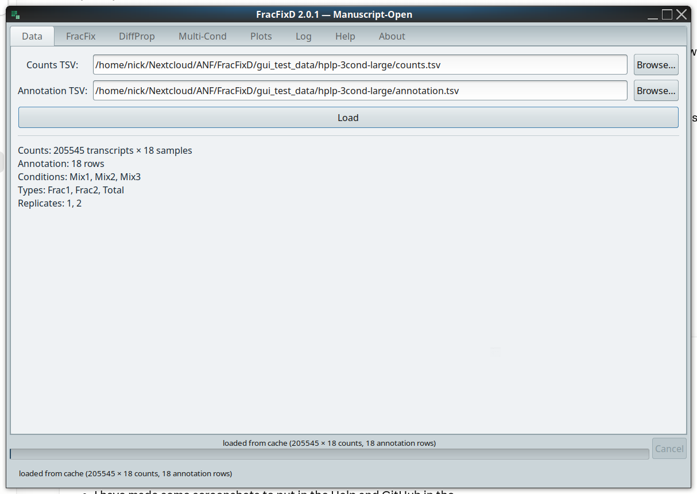
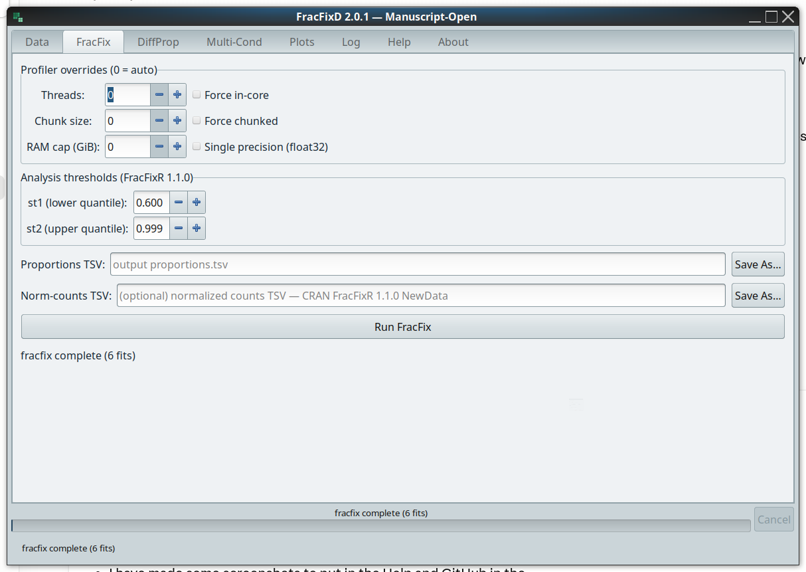
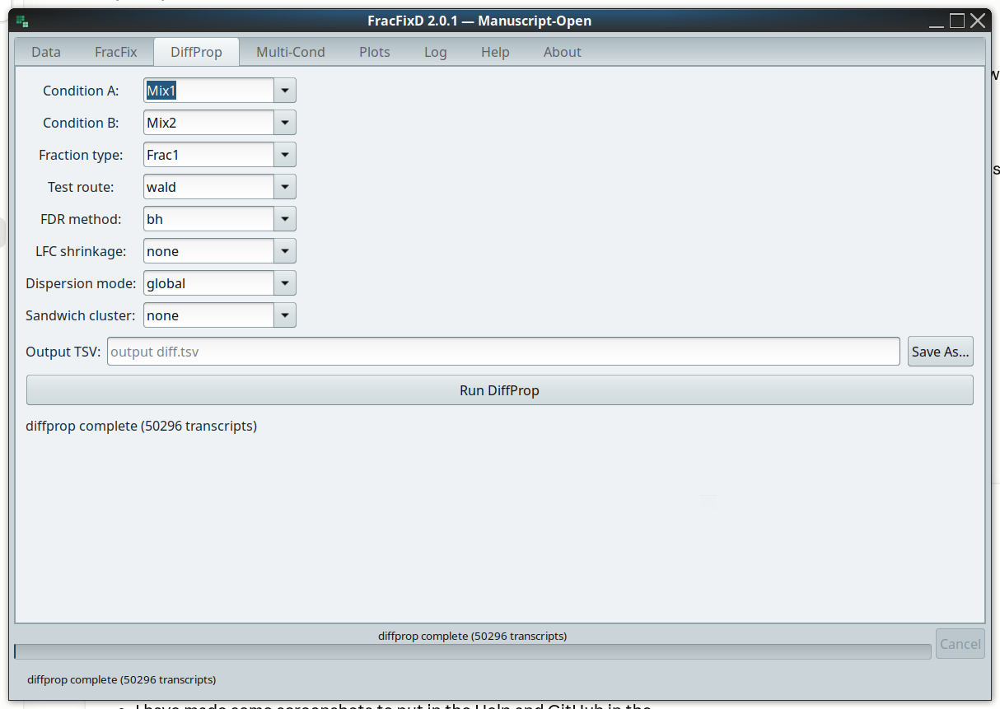
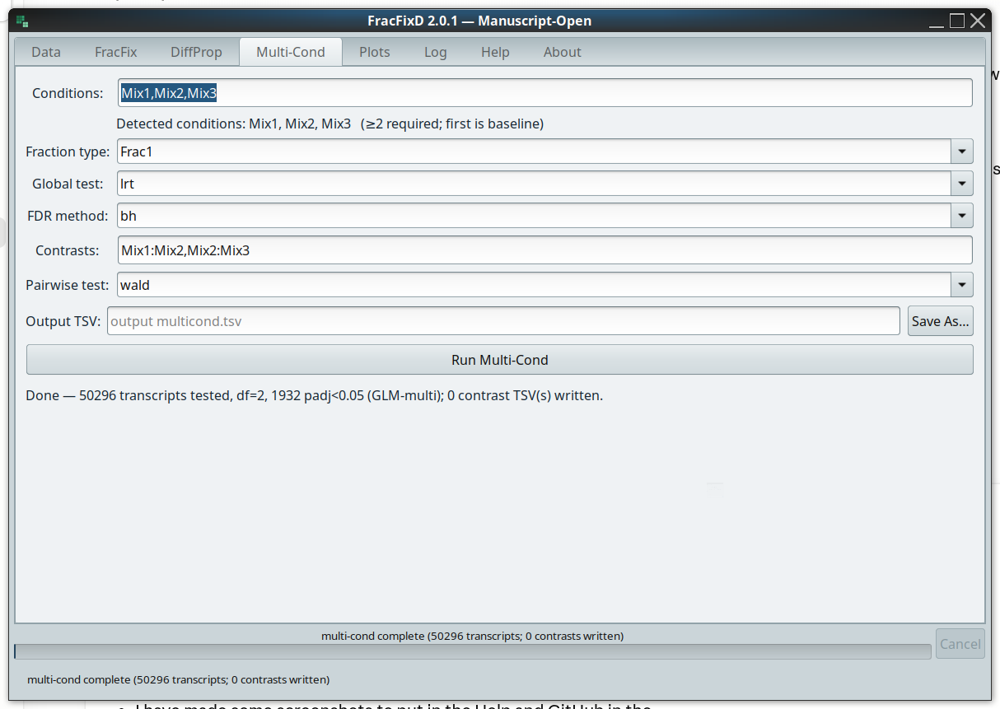
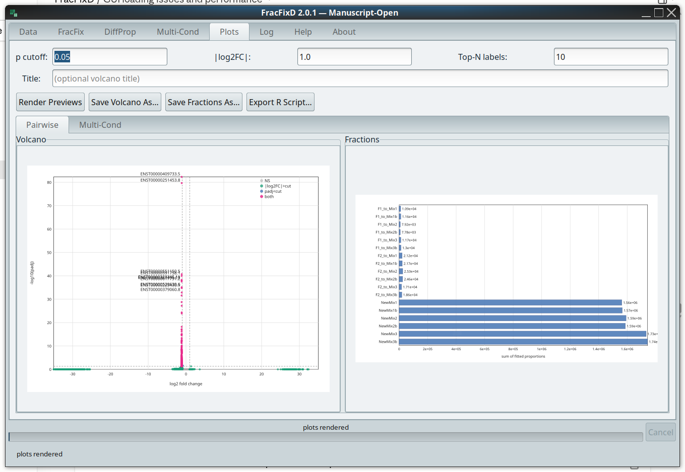
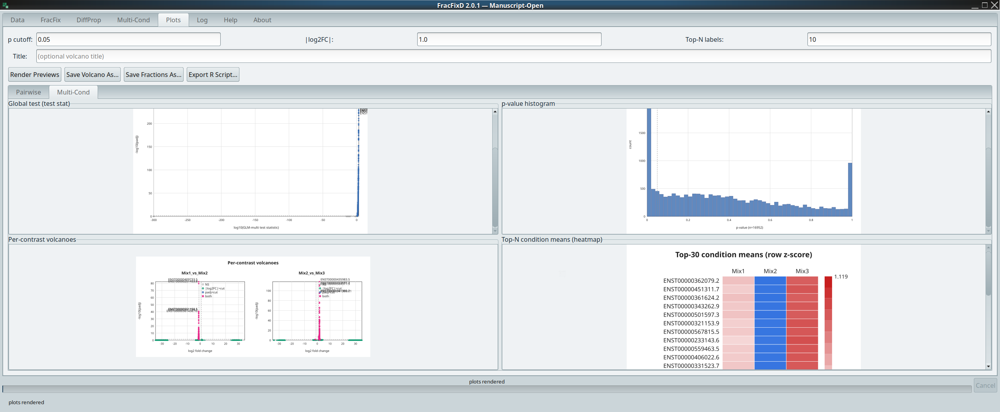
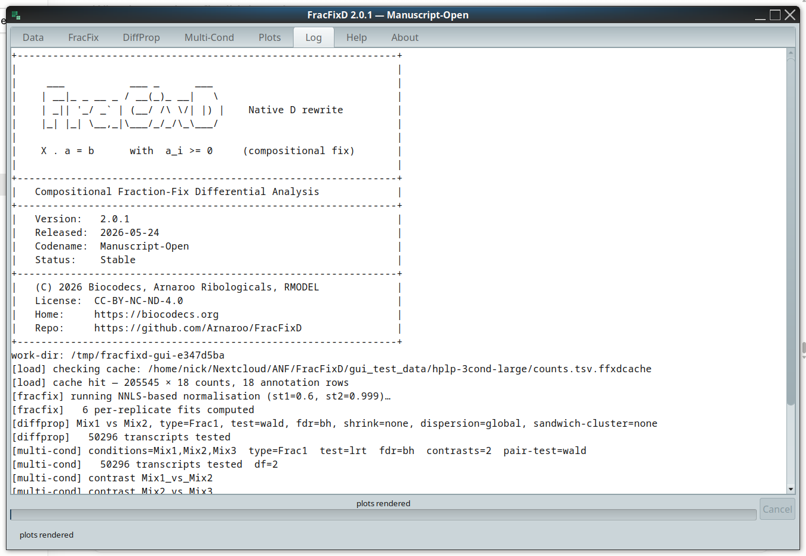

# FracFixD: a native-D rewrite of FracFixR providing a fast compositional fractional fixup and differential proportion testing for RNA fractionation data

> **A native-D, single-binary, GUI-and-CLI compositional statistics
> tool for fractionated RNA sequencing assays, built from the ground
> up for *pipeline-scale* throughput.**
> Run the same NNLS-based fraction recovery and beta-binomial
> differential-proportion testing as FracFixR, but as a single
> portable executable that processes 100k-transcript experiments in
> seconds, integrates as a Snakemake / Nextflow step without an R
> install, and ships a GTK3 GUI for interactive exploration when you
> want one.

<p align="center">
  
</p>

<p align="center">
  <a href="https://github.com/Arnaroo/FracFixR/releases/tag/fracfixd-v2.1.0"></a>
  <a href="https://doi.org/10.5281/zenodo.20234583"></a>
  <a href="https://doi.org/10.1093/bioinformatics/btaf615"></a>
  <a href="LICENSE"></a>
  
</p>

---

## GUI tour

The single binary launches the GTK 3 GUI with no arguments and
drops into the CLI when given any subcommand or `--cli`.  The
tour below walks the seven operational tabs on the worked
3-condition example fixture (`Mix1 / Mix2 / Mix3 × Frac1 /
Frac2 / Total × 2 reps`, 205 545 transcripts).

### 1 Data tab: load counts + annotation

Drop the two TSVs into the path entries (or use the Browse
dialogs).  Hit Load and the counts file is parsed in ≈ 95 ms cold
(`~80 ms warm via the on-disk parsed-input cache, written
beside the TSV as `<file>.ffxdcache`).  A determinate
byte-progress bar and a working Cancel button cover any large
load.

<p align="center">
  
</p>

### 2 FracFix tab: compositional fixup

Optional sliders for the FracFixR-1.1.0 `st1 / st2` quantile
bounds and an auto-profiler override row.  Click Run; the
status line reports the number of per-replicate NNLS fits
computed.

<p align="center">
  
</p>

### 3 DiffProp tab: pairwise differential proportions

Pick condition A / B, fraction type, test route, and the FDR /
shrinkage / dispersion / sandwich-cluster selectors.  Seven
test backends are available (Wald, GLM-LRT, logit, score, HC0 /
HC3 sandwich, quasi).

<p align="center">
  
</p>

### 4 Multi-Cond tab: K-condition global test

The detected conditions auto-fill on load, while the first condition is
the design-matrix baseline.  Pick `lrt` or `wald` for the
global test, optional comma-separated contrast pairs
(`Mix1:Mix2,Mix2:Mix3` here).  Companion contrast TSVs land
alongside the global TSV via the same `<out>.A_vs_B.tsv` naming
pattern the CLI uses.

<p align="center">
  
</p>

### 5 Plots tab → Pairwise sub-tab

Volcano (DiffProp result) + per-sample fractions barplot
(FracFix result), side by side.  All plots support Ctrl+wheel
zoom (per-pane) and Ctrl++ / Ctrl+- / Ctrl+0 (all-panes).

<p align="center">
  
</p>

### 6 Plots tab → Multi-Cond sub-tab

Four diagnostic plots from the Multi-Cond result:
top-left = global-test volcano, top-right = p-value histogram,
bottom-left = per-contrast volcano grid, bottom-right = top-N
condition-means heatmap.

<p align="center">
  
</p>

### 7 Log tab: live audit trail

Every worker log line lands here in append-only form, mirroring
what would have gone to the `--log FILE` of an equivalent CLI
invocation.  Useful for translating a GUI session back into a
reproducible CLI command for a Snakemake / Nextflow rule.

<p align="center">
  
</p>

---

## What FracFixD is for

FracFixD is the binary-distribution sibling of
[**FracFixR**](https://github.com/Arnaroo/FracFixR), the R package
that implements compositional fixup for fractionated RNA-seq
experiments (polysome profiling, subcellular fractionation,
RNA-protein complex isolation, any assay that splits one sample
into several library-prepped fractions).  Where FracFixR is the
canonical, open-source, R-native reference, FracFixD is the same
mathematics re-implemented in D for native parallel throughput and packaged as a single self-contained executable.

FracFixD targets four audiences that an R-only release serves
less well:

1. **Pipeline authors** building Snakemake / Nextflow / SLURM
   workflows who want a *single dropped-in binary* with no R
   install, no library version negotiation, no `renv.lock`
   shipping alongside the workflow.  The static CLI is a 2.5 MB
   executable that produces the same proportion fits and
   differential-proportion p-values FracFixR does.
2. **High-throughput / cluster users** running ten-thousand to
   million-transcript experiments where the R baseline is too
   slow.  FracFixD uses the same NNLS / GLM / beta-binomial Wald
   stack but routes the inner numerical loops through LDC-LLVM-
   compiled SIMD code, with `znver2` and `broadwell` microarch-
   tuned release builds.
3. **Bench scientists who want a GUI** without installing R,
   RStudio, BiocManager dependencies, and a stack of CRAN
   packages.  Double-click the binary and the GTK3 multi-tab
   interface walks you through count loading, fractional fixup,
   diff-prop testing, and volcano plotting.
4. **Statisticians comparing alternative tests** for
   over-dispersed fractional data.  FracFixD ships seven
   diff-prop test backends (binomial-GLM LRT, logit-Wald,
   beta-binomial Wald, Rao score, HC0 / HC3 sandwich, quasi-
   binomial), three FDR procedures (BH / BY / Storey), four
   posterior-shrinkage estimators (Gaussian / apeglm / ashr),
   and Bayesian / bootstrap / Wald confidence intervals on the
   recovered proportions.

If you work with **polysome profiling, subcellular fractionation,
nuclear / cytoplasmic RNA, monosome / disome / oligosome
profiles, ribosome occupancy, RNA-protein complex isolation,
sucrose-gradient fractions, or any other compositional RNA
assay** and you've ever wished FracFixR was faster, or shipped
as a single binary instead of a CRAN package, FracFixD is built
for you.

---

## Why FracFixD is different (vs FracFixR)

| Capability | What it means in practice |
|---|---|
| **Native-D, LDC-compiled inner loops** | NNLS, IRLS (binomial GLM), L-BFGS-B (beta-binomial), and the Wald / score / sandwich variants all run as compiled native code with `-O3 --flto=full -boundscheck=off`.  Per-transcript fits are dispatched across CPU cores via `std.parallelism.taskPool`. |
| **Microarchitecture-tuned release builds** | Three Linux x86_64 binaries ship out of the box: `znver2` (Zen 2 Ryzen 3000/4000/5000), `broadwell` (Intel 5th-gen onward), and `generic` (x86-64-v3 baseline; runs on most 2013+ CPUs).  Pick the one that matches your cluster's silicon. |
| **One code path, GUI and CLI** | Linux and macOS ship a single executable: run it with no arguments → GTK3 GUI launches; run it with `--cli` or any subcommand → headless console mode.  Windows ships two, because a Windows graphical process is given no console to write to, so `fracfixd.exe` opens the interface and `fracfixd-cli.exe` serves cmd and PowerShell.  Same code path under the hood in every case. |
| **Self-contained static CLI** | The `fracfixd-cli-linux-x86_64-static` artefact links the D runtime statically and depends only on the C runtime: `libc`, `libm`, `libgcc_s` and the loader.  2.5 MB.  Perfect for container images and HPC node-locals. |
| **Caching pipeline** | `fracfix --cache-fits FILE.cache` saves the per-replicate NNLS fits + proportions matrix; `diffprop --from-cache FILE.cache` skips the entire fixup step.  Same statistical output, ~10× faster re-runs when you only need to vary the diff-prop knobs. |
| **Native binary proportions format** | `--out-proportions-bin FILE.bin` writes the FFXD1BIN packed-double format; `diffprop --norm FILE.bin` parses it ~30× faster than the equivalent TSV. |
| **Deterministic step rule for SIMD reproducibility** | `--bb-step-rule deterministic` opts the beta-binomial fitter into a basin-desensitised L-BFGS-B variant with pure-double special functions, reproducible across CPU microarchitectures and SIMD widths. |
| **Native SVG volcano plots** | `fracfixd plot --diff FILE --out FILE.svg` renders a publication-grade volcano in SVG 1.1 (renderer-stable across librsvg, Inkscape, Firefox).  Optional `--r-script FILE.R` emits an EnhancedVolcano-style ggplot reproduction script. |
| **Compositional QC built-in** | `--qc on|strict` runs intercept-stability + per-replicate κ(X) checks before the fits commit; `--qc-report FILE` writes a TSV diagnostic alongside the proportions. |
| **No telemetry, no cloud, no account** | FracFixD is a desktop / CLI application.  It does not phone home.  All inputs and outputs are local files. |

FracFixR remains the **reference** implementation and the open-
source, scientifically-citeable form of the method.  FracFixD is
its production binary sibling.  See the
[**Statistical equivalence**](#statistical-equivalence) section
below for the numerical-agreement contract.

---

## What you get out of the box

### Subcommands

- **`fracfixd fracfix:`**  compositional fixup (proportions
  recovery + lost-fraction estimation).  Produces a self-
  describing proportions TSV / `.bin` you can hand to any
  downstream tool.
- **`fracfixd diffprop:`** differential-proportion testing
  between two or more conditions, with the full battery of
  asymptotic and permutation tests.
- **`fracfixd plot:`** volcano SVG renderer with optional R
  reproduction script.
- **`fracfixd demo:`** runs all three of the above over a worked
  example that ships inside the binary.  No arguments, no data, no
  network.
- **`fracfixd help [SUBCOMMAND]:`** detailed per-subcommand help
  and changelog.

### Statistical tests (`--test`)

`glm` (binomial-GLM LRT, canonical) · `logit` (binomial GLM
Wald) · `wald` (beta-binomial regression Wald) · `score` (Rao
score test, robust under separation) · `sandwich-hc0`,
`sandwich-hc3` (White / MacKinnon-White heteroskedasticity-
consistent SEs, optional clustering) · `quasi` (quasi-binomial
Wald with Pearson φ inflation).

### Multi-condition tests (`--multi-cond`)

Global LRT (df = K-1) or joint Wald χ² across K ≥ 2 conditions,
with optional per-pair contrasts (`--contrast A:B,A:C,...`).

### Dispersion modelling (`--dispersion`)

`global` (single φ̂ from the data) · `trend` (count-binned
mean-φ trend) · `per-transcript` (each transcript's own φ̂).
Optional Bayesian shrinkage prior on log-φ
(`--phi-prior trended` with df controlled by `--phi-prior-df`).

### Multiple-testing correction (`--fdr`)

`bh` (Benjamini-Hochberg) · `by` (Benjamini-Yekutieli) ·
`storey` (single-λ q-values, less conservative when π₀ < 1).
Optional independent filtering (`--filter-by mean|count
--filter-quantile F`) to reclaim power on low-count tails.

### Posterior shrinkage (`--shrink`)

`normal` (empirical-Bayes Gaussian prior, τ² from the data) ·
`apeglm` (Cauchy-prior posterior mode; Zhu, Ibrahim & Love
2018) · `ashr` (adaptive-shrinkage scale mixture; Stephens
2017).  Writes both the raw and shrunken log₂FC columns.

### Robust NNLS (`--nnls`)

`plain` (default) · `ridge` (L₂-regularised;
`--ridge-lambda`) · `auto` (κ(X)-triggered fallback;
`--nnls-auto-trigger`).

### Permutation p-values (`--permutation`)

Per-transcript label-permutation reference for the asymptotic
p-values.  Cluster-friendly: a `splitmix64` mixer makes the
per-transcript stream independent of `--threads`.  Gate
expensive permutation work to low-count rows via
`--permutation-min-count`.

### Resumable pipeline (`--cache-fits` / `--from-cache`)

Save the FracFix step's per-replicate fits and proportions
matrix to a `.cache` file once; reuse from any number of
downstream `diffprop` invocations.

### Output formats

**Proportions**: TSV (default; matches FracFixR `write.table` byte
shape) or FFXD1BIN packed-double (`--out-proportions-bin`).
**Differential results**: TSV with raw + shrunken log₂FC,
asymptotic + permutation p-values, padj, phi-hat columns.
**Plots**: SVG 1.1 volcano (`fracfixd plot`); optional R
reproduction script.

### Logging / scheduling

`--log FILE` (timestamped log file) · `--verbosity tXlY` (split
terminal / log levels) · `--quiet` / `--verbose` shorthands ·
`--progress` (INDEGRA-format stage markers on stderr,
independent of `--quiet`).
`--threads N` · `--chunk N` · `--ram-cap-gib X` ·
`--in-core` / `--chunked` (scheduler overrides).

---

## Statistical equivalence

FracFixD is verified against FracFixR on every release via an
in-tree equivalence harness:

- **Default-flag `--test glm` / `--test logit`**: Spearman
  ρ(log₂FC) ≥ 0.99 and ρ(−log₁₀ p) ≥ 0.95 on the standard
  synthetic fixtures.
- **Default-flag `--test wald`**: same Spearman targets; the
  `|Δlog₁₀ p|` envelope is 0.20 because the beta-binomial MLE
  has a wider convergence basin than the GLM LRT route.
- **`--bb-step-rule deterministic`**: experimental opt-in mode
  (basin-desensitised L-BFGS-B + pure-double special
  functions).  Reproducible across CPU microarchitectures and
  SIMD widths; classic mode is the default and is unchanged.

The reference R outputs are produced from a fresh
`devtools::install_github("Arnaroo/FracFixR/CRAN")` per equivalence
run so the harness *notices* if upstream FracFixR changes its
behaviour.

---

## Install

### Which build do I want

No artefact needs a numerical library. FracFixD implements its own NNLS,
IRLS and L-BFGS-B in D, so no BLAS or LAPACK is called on any platform,
none is bundled, and none has to be installed. `objdump -p` on the
Windows binaries and `readelf -d` on the Linux ones both bear this out:
the only libraries named are the C runtime and, for the graphical
builds, GTK.

The one real distinction is the graphical interface.

| Build | Graphical interface | Needs GTK 3 present | Use it for |
|---|---|---|---|
| `fracfixd-linux-*-x86_64` | yes | yes, always | desktops and laptops |
| `fracfixd-cli-linux-x86_64-static` | no | no | servers, clusters, containers, CI |
| macOS `.app` or tarball | yes | no, GTK is bundled | any Mac |
| Windows ZIP, `fracfixd.exe` | yes | no, GTK is bundled | any Windows host |
| Windows ZIP, `fracfixd-cli.exe` | no | no | Windows servers, clusters, CI |

There are three ways to run FracFixD, and the second one surprises
people:

1. `fracfixd` with no arguments opens the graphical interface.
2. `fracfixd --cli ...` runs the command line pipeline from the same
   binary. **On Linux this still requires GTK 3**, because the
   graphical toolkit is loaded while the process starts, before any
   argument is read. This is why `fracfixd --version` fails on a
   headless host. **On Windows this prints nothing at all**, because
   `fracfixd.exe` is a graphical subsystem program and Windows gives
   such a program no console to write to. Redirection still works, so
   `fracfixd.exe --cli --version > out.txt` fills the file normally.
3. `fracfixd-cli`, and `fracfixd-cli.exe` on Windows, is built without
   the graphical interface at all and requires nothing beyond the C
   library.

On a Linux host with no GTK 3 the GUI capable build stops immediately
and says so, naming the headless build. If you are installing on a
cluster or in a container, take the static CLI and skip GTK entirely.

### Linux: what is actually required

Measured with `ldd` on the published Linux artefacts.

**Linked at load time, every Linux artefact:**

| Library | Provided by |
|---|---|
| `libc.so.6` | glibc |
| `libm.so.6` | glibc |
| `libgcc_s.so.1` | GCC runtime, present on every distribution |

That is the whole list. No BLAS or LAPACK appears because none is
called: the solvers are written in D and compiled into the binary.

**glibc floor: 2.34.** The binaries carry versioned symbol references
up to `GLIBC_2.34`, so an older glibc cannot load them. Check yours:

```bash
ldd --version | head -1
```

| Distribution | glibc | Runs the published binaries |
|---|---|---|
| Ubuntu 22.04 and later | 2.35+ | yes |
| Debian 12 and later | 2.36+ | yes |
| RHEL, Rocky, Alma 9 | 2.34 | yes |
| Fedora 35 and later | 2.34+ | yes |
| Arch, Manjaro | current | yes |
| Ubuntu 20.04 | 2.31 | no |
| RHEL, CentOS 8 | 2.28 | no |

On a host below the floor, build from source against the local glibc.

**Loaded on demand, GUI capable builds only.** GTK is opened by name at
process start rather than linked, so it never shows up in `ldd`. Eleven
libraries must be resolvable:

```
libgtk-3.so.0          libgdk-3.so.0           libgobject-2.0.so.0
libglib-2.0.so.0       libgio-2.0.so.0         libgmodule-2.0.so.0
libgdk_pixbuf-2.0.so.0 libpango-1.0.so.0       libpangocairo-1.0.so.0
libcairo.so.2          libatk-1.0.so.0
```

All ten of the others are dependencies of `libgtk-3.so.0`, so a single
package pulls the set in. Tested against GTK 3.24. Any GTK 3.22 or
later should work; GTK 4 is not a substitute.

```bash
# Arch, Manjaro
sudo pacman -S gtk3

# Ubuntu, Debian
sudo apt-get install libgtk-3-0

# Fedora, RHEL
sudo dnf install gtk3
```

Check whether your host already qualifies:

```bash
ldconfig -p | grep -c libgtk-3.so.0     # 1 or more means yes
```

### Quick install (Linux)

Pick the binary that matches your CPU and drop it on your
`$PATH`:

```bash
# AMD Zen 2 / 3 / 4 (Ryzen 3000+, EPYC Rome / Milan / Genoa)
curl -fsSL https://github.com/Arnaroo/FracFixR/raw/main/FracFixD/bin/fracfixd-linux-znver2-x86_64 \
     -o /usr/local/bin/fracfixd && chmod +x /usr/local/bin/fracfixd

# Intel Broadwell or newer (i5 / i7 5th-gen+, Xeon E5 v4+)
curl -fsSL https://github.com/Arnaroo/FracFixR/raw/main/FracFixD/bin/fracfixd-linux-broadwell-x86_64 \
     -o /usr/local/bin/fracfixd && chmod +x /usr/local/bin/fracfixd

# Generic x86-64-v3 baseline (runs on most 2013+ CPUs)
curl -fsSL https://github.com/Arnaroo/FracFixR/raw/main/FracFixD/bin/fracfixd-linux-generic-x86_64 \
     -o /usr/local/bin/fracfixd && chmod +x /usr/local/bin/fracfixd

# Static CLI (no GUI, minimal runtime deps; ideal for containers / HPC)
curl -fsSL https://github.com/Arnaroo/FracFixR/raw/main/FracFixD/bin/fracfixd-cli-linux-x86_64-static \
     -o /usr/local/bin/fracfixd-cli && chmod +x /usr/local/bin/fracfixd-cli
```

On a server or cluster, take the static CLI and nothing else. It is
under 3 MB, needs no GTK and no BLAS, and runs the identical analysis
code.

Verify the download:

```bash
sha256sum -c <(curl -fsSL https://github.com/Arnaroo/FracFixR/raw/main/FracFixD/bin/SHA256SUMS)
fracfixd-cli --version
```

`SHA256SUMS` covers every published artefact, so the same command
verifies the macOS and Windows packages.

### macOS (arm64)

A native arm64 `.dmg` is shipped alongside the Linux binaries:

```bash
# Download the .dmg
curl -fsSL https://github.com/Arnaroo/FracFixR/raw/main/FracFixD/bin/FracFixD-2.1.0-macos-arm64.dmg \
     -o FracFixD-2.1.0-macos-arm64.dmg

# Verify (compare against SHA256SUMS)
shasum -a 256 FracFixD-2.1.0-macos-arm64.dmg

# Mount + install
open FracFixD-2.1.0-macos-arm64.dmg
# Drag FracFixD.app into the Applications symlink.
```

First launch: right-click `FracFixD.app` → Open to clear the
one-time Gatekeeper confirmation (the binary is ad-hoc signed,
not Developer-ID notarised).  Or clear the quarantine flag from
Terminal:

```bash
xattr -dr com.apple.quarantine /Applications/FracFixD.app
```

For CLI and pipeline use, a relocatable tarball is also shipped:
`fracfixd-2.1.0-macos-arm64.tar.gz`.  Extract and call
`./fracfixd-macos/bin/fracfixd-launcher.sh --cli ...` from any
location.

#### macOS dependencies: nothing to install

**You do not need Homebrew to run FracFixD on macOS.** The `.app` and
the tarball carry 35 dynamic libraries in their own `lib/` directory,
covering the whole closure:

| Group | Bundled |
|---|---|
| Toolkit | the full GTK 3.24 stack: GTK, GDK, GLib, GObject, GIO, Pango, Cairo, ATK, gdk-pixbuf, HarfBuzz, Fontconfig, FreeType |
| X11 | `libX11.6`, `libXrender.1`, `libXext.6`, `libxcb.1`, `libXau.6`, `libXdmcp.6` |

Nothing resolves against `/opt/homebrew` or `/usr/local` at runtime.

The launcher exists to point the loader at that directory, and it is
the whole of the mechanism:

```bash
#!/bin/bash
HERE="$(cd "$(dirname "${BASH_SOURCE[0]}")" && pwd)"
LIBDIR="$(cd "$HERE/../lib" && pwd)"
export DYLD_LIBRARY_PATH="$LIBDIR${DYLD_LIBRARY_PATH:+:$DYLD_LIBRARY_PATH}"
exec "$HERE/fracfixd" "$@"
```

So call the launcher rather than `bin/fracfixd` directly. If you do
call the binary directly, set the path yourself:

```bash
export DYLD_LIBRARY_PATH=/path/to/fracfixd-macos/lib:$DYLD_LIBRARY_PATH
/path/to/fracfixd-macos/bin/fracfixd --cli --version
```

Inside the `.app` the equivalent path is
`FracFixD.app/Contents/Resources/lib`, and the bundle wires this up
itself, so double clicking needs no setup.

Homebrew is required only to build from source:

```bash
brew install dub gtk+3 dylibbundler pkg-config
```

Minimum macOS 13 (Ventura). Apple Silicon only; Intel Macs are not
covered by the published artefact.

### Windows (x86_64)

A pre-built portable ZIP is shipped alongside the Linux and
macOS artefacts:

```powershell
# PowerShell download the ZIP
Invoke-WebRequest -Uri https://github.com/Arnaroo/FracFixR/raw/main/FracFixD/bin/fracfixd-v2.1.0-windows-x86_64.zip `
    -OutFile fracfixd-v2.1.0-windows-x86_64.zip

# Verify (compare against SHA256SUMS in the same folder)
Get-FileHash fracfixd-v2.1.0-windows-x86_64.zip -Algorithm SHA256

# Extract anywhere and double-click `fracfixd-windows\fracfixd.exe`
Expand-Archive fracfixd-v2.1.0-windows-x86_64.zip -DestinationPath .
.\fracfixd-windows\fracfixd-cli.exe --version
```

The ZIP is about 27 MB and bundles two executables together with their
whole runtime closure, about forty-seven DLLs: GTK 3.24 and the MinGW C
runtime. It runs as a self contained folder on any Windows 10 or 11
x86_64 host with nothing else installed. No Visual C++ redistributable
is needed. Only `fracfixd.exe` uses those DLLs; `fracfixd-cli.exe`
imports nothing but Windows system libraries and will run on its own.

`fracfixd-cli.exe` is the console binary, and the one to use from cmd,
PowerShell, a batch script or a scheduled job on a headless or server
host. `fracfixd.exe` opens the graphical interface and writes nothing
to a console, because Windows gives a graphical subsystem program no
console at all. That is why the two are separate files.

For users who prefer a system-wide install with PATH
integration and an uninstaller, the source-build tooling also
produces an Inno Setup `.exe` installer.  Source-tree access
and build tooling are provided by request (see
[*Source code*](#source-code)).

### Platforms the release was tested on

| Platform | Version | Build exercised |
|---|---|---|
| Manjaro Linux, x86_64 | rolling, glibc 2.43 | GUI and static CLI |
| macOS, Apple Silicon | 26.2 (Tahoe) | `.app` and tarball |
| Windows 11, x86_64 | build 22631 | portable ZIP |

Every artefact is compiled with LDC 1.42.0 and DUB 1.41.0. The Linux
binaries are built on Linux, and the macOS and Windows packages on
their native hosts.

### Library versions built against

| Component | Linux | macOS | Windows |
|---|---|---|---|
| GTK | 3.24, from the host | 3.24.52, bundled | 3.24.51, bundled |
| glibc floor | 2.34 | not applicable | not applicable |

GTK is the only external library on the list because it is the only one
FracFixD links. There is no BLAS row.

Resolved D package versions, pinned in `dub.selections.json`:

| Package | Version | | Package | Version |
|---|---|---|---|---|
| gtk-d | 3.10.0 | | mir-core | 1.7.4 |
| mir-algorithm | 3.22.4 | | mir-linux-kernel | 1.2.1 |
| mir-random | 2.2.20 | | | |

---

## Try it with no data of your own

```bash
fracfixd demo
```

That is the whole command.  A 300-transcript, 18-library example is
compiled into the binary, so there is nothing to download and nothing
to configure; the demo runs offline on a machine that has never seen
FracFixD before.  It writes the inputs to `./fracfixd-demo`, runs the
three pipeline steps over them, and echoes each command line as it
goes, so you can lift any step out and repeat it by hand.

The dataset is a simulated polysome profiling experiment: two
conditions (WT, KO), three replicates, three fractions (Total,
Monosome, Polysome).  It is simulated forward through the model
FracFixR assumes, and a designated set of transcripts really does
change its polysome share, with the signs chosen so the net polysomal
mass moved is close to zero.  That last detail matters more than it
sounds: the correction step fits one set of recovery coefficients per
replicate across all transcripts, so a planted set that is unbalanced
drags every other transcript's estimate along with it.

Eight files land in `fracfixd-demo/`: the two inputs, the corrected
`proportions.tsv`, a per-replicate `qc-report.tsv`, the per-transcript
`diffprop.tsv`, two SVG plots, and a `README.txt` that explains every
output column and repeats the three commands so the folder still makes
sense when you come back to it.

Useful variations:

```bash
# Write the inputs and stop, then drive the pipeline yourself.
fracfixd demo --extract-only --outdir my-first-run

# Somewhere other than ./fracfixd-demo
fracfixd demo --outdir /tmp/scratch

# Swap the differential backend.
fracfixd demo --test glm
```

The last one is worth running.  The default `wald` route is a
beta-binomial with an overdispersion parameter and calls 30 of the 300
transcripts; `glm` is a plain binomial and calls 106.  The extra hits
are not a discovery, they are the binomial refusing to believe that
three replicates disagree.  The estimated proportion carries noise
from the fraction libraries as well as from the Total, and a plain
binomial has nowhere to put it.  This is the reason `wald` is the
default.

GUI users get the same run from the **Use demo data** button on the Data
tab.  It writes the dataset to `fracfixd-demo` in your home folder, loads
it, and fills in every parameter, leaving two buttons to press: **Run
FracFix**, then **Run DiffProp**.  Those two clicks are not laziness on
our part.  The pipeline has two stages for a reason, and watching the
correction complete before the test begins is the shortest way to see
why.

The GUI and the CLI read the same parameters from the same place in the
source, so on one machine both produce a byte-identical `diffprop.tsv`.
This is worth a sentence because it is not automatic: the annotation
reader returns conditions and fractions in alphabetical order, so a GUI
that simply took the first of each would run KO against WT on the
monosome, and report the mirror image of a different comparison without
complaining.

Across machines the file is not byte-identical, and the demo prints the
number it is safe to compare instead.  The beta-binomial backend
evaluates its special functions at D's `real` precision, which the
hardware defines: 64 mantissa bits on x86, 53 on ARM.  The demo pins
`--bb-step-rule deterministic`, which runs them in `double` throughout
and removes almost all of that difference, but not the last digit of
the six the output carries.  The Linux and macOS builds of this release
call the same 30 of 300 transcripts at `padj` below 0.05, with no
transcript called on one and not the other, and differ in 232 of 5100
printed cells.  So compare the count the demo prints, not the file
hash.  `diffprop` invoked directly is unaffected: it still takes the
`classic` default.

---

## Quick start (CLI)

Minimal pairwise differential-proportion run, GLM-LRT route:

```bash
# 1. Fractional fixup: recover proportions from raw fraction counts
fracfixd fracfix \
    --counts counts.tsv \
    --annot  annotation.tsv \
    --out    proportions.tsv

# 2. Differential testing between two conditions
fracfixd diffprop \
    --counts     counts.tsv \
    --annot      annotation.tsv \
    --norm       proportions.tsv \
    --conditionA WT --conditionB KO \
    --type       Fraction1 \
    --test       glm \
    --out        diffprop.tsv

# 3. Volcano SVG
fracfixd plot \
    --diff diffprop.tsv \
    --out  volcano.svg
```

`counts.tsv` is a transcript × sample integer matrix; `annotation.tsv`
maps each sample column to its `(Condition, Replicate, Fraction)`
triplet.  Both formats are documented under `fracfixd help fracfix`.

Multi-condition global LRT with per-pair contrasts:

```bash
fracfixd diffprop \
    --counts counts.tsv --annot annotation.tsv --norm proportions.tsv \
    --multi-cond \
    --conditions WT,KO,RESCUE \
    --multi-cond-test lrt \
    --contrast WT:KO,WT:RESCUE \
    --type Fraction1 --test wald \
    --out diffprop.tsv
```

Pipeline-style invocation with caching, parallel threads,
progress markers, and the static CLI binary:

```bash
fracfixd-cli fracfix --counts counts.tsv --annot annotation.tsv \
    --out-proportions-bin props.bin \
    --cache-fits fits.cache \
    --threads 16 --progress --quiet

fracfixd-cli diffprop \
    --counts counts.tsv --annot annotation.tsv \
    --from-cache fits.cache \
    --conditionA WT --conditionB KO --type Fraction1 \
    --test wald --fdr storey --shrink apeglm \
    --out diffprop.tsv \
    --threads 16 --progress --quiet
```

Two families of option were added in v2.1.0.  Both are opt-in and
both leave the default output byte identical to v2.0.6.

```bash
# How the permutation null is built.  Takes effect only when
# --permutation N is given.  labels is the default and reshuffles
# the condition assignment; at three replicates per condition that
# leaves ten distinct assignments, so no p-value below 0.05 is
# attainable.  binomial redraws each sample's successes from the
# pooled null proportion at its own depth and lifts that floor.
fracfixd diffprop ... --permutation 2000 --resample binomial

# bootstrap resamples replicates within condition and returns an
# interval instead of a p-value, because it does not impose the null.
fracfixd diffprop ... --permutation 2000 \
    --resample bootstrap --resample-ci-level 0.95

# What to do with a transcript whose pooled Total is empty in at
# least one (condition, replicate) column.  drop is the default and
# matches FracFixR.  partial fits on the samples that do have data,
# provided at least three survive.
fracfixd diffprop ... --zero-handling partial
fracfixd diffprop ... --zero-handling pseudo --pseudocount 0.5
```

`--resample bootstrap` fills the `log2FC_ci_lo` and `log2FC_ci_hi`
columns and leaves `permutation_pvalue` at NaN.  `--resample-ci-level L`
sets the confidence level for that interval, 0.95 by default, by the
percentile method with the (N+1) plotting position.

The QC report written by `fracfixd fracfix --qc-report FILE` gained an
`intercept_share` column in the same release: the fitted intercept
divided by the mean pooled Total over the rows that entered the fit,
reported as a diagnostic and not tested against any threshold.

See `fracfixd help diffprop` for the full flag inventory
(roughly 50 options grouped by purpose, including testing, dispersion,
FDR, shrinkage, permutation, QC, output formatting, logging).

---

## Known limitations

These are documented up front so you can decide whether FracFixD
fits your workflow.

- **x86_64 only on Linux and Windows; arm64 only on macOS.**
  Linux/macOS arm64 (Linux on Apple Silicon, Raspberry Pi, etc.)
  and x86_64 macOS (Intel Macs) are planned for follow-up
  releases.
- **Windows installer is portable-ZIP only.**  A signed Inno
  Setup `.exe` installer can be produced from the source tree;
  the released artefact is the unsigned portable ZIP, so Windows
  SmartScreen may flag it on first launch (click "More info"
  then "Run anyway").
- **`--bb-step-rule deterministic` ships EXPERIMENTAL.**  On the
  N=1000 dev fixture it reaches log₂FC Spearman 0.98 (vs the
  classic 0.99+ target), the residual gap is a small number of
  φ-boundary transcripts where the deterministic kernel finds a
  legitimately different (often better) MLE than classic.
  Default classic mode is the recommended setting.
- **The Linux GUI build needs GTK 3 even in CLI mode.**  The
  toolkit is loaded while the process starts, before any argument
  is read, so `fracfixd --cli` and even `fracfixd --version` need
  GTK 3 present.  On a host without it the binary stops at once
  and names the headless build.  Use
  `fracfixd-cli-linux-x86_64-static` on servers and clusters: it
  has no GTK dependency and no BLAS dependency.  See
  [*Install*](#install).
- **`fracfixd.exe` prints nothing to a Windows console.**  It is
  linked as a graphical subsystem program, so launching it opens
  no console window, and Windows correspondingly gives it no
  console to write to.  `fracfixd.exe --cli --version` therefore
  appears to do nothing when typed at a prompt.  Redirection is
  unaffected, so `fracfixd.exe --cli --version > out.txt` fills
  the file as expected, which is worth knowing because it
  otherwise looks inconsistent.  Use `fracfixd-cli.exe` for
  interactive command line work.
- **Linux binaries need glibc 2.34 or later.**  RHEL 8 and
  Ubuntu 20.04 are below the floor and require a build from
  source.
- **No Hi-C / multi-omic extensions.**  FracFixD is single-purpose:
  compositional fractional fixup + differential-proportion
  testing.  For genome or transcriptome browser visualisation pair it with
  [VX](https://github.com/Arnaroo/VX); for full RNA-seq quant
  pair it with salmon / kallisto upstream.

Full build provenance (toolchain, compiler flags, library
bundling, and verification recipes) accompanies each binary in
the Zenodo deposit and is available with source-tree access on
request (see [*Source code*](#source-code)).

---

## Repository layout

This subfolder is the **public-facing distribution tree** for
FracFixD.  The D source code that produces the binaries is
held in a separate private development tree under a
proprietary licence (see *Source code* below).

| Folder | Contents | Licence |
|---|---|---|
| [`bin/`](bin/) | Pre-compiled binaries for all three platforms (Linux x86_64 microarchitecture variants and static CLI, macOS arm64 `.dmg` and tarball, Windows x86_64 portable ZIP holding both the graphical and the console executable) plus `SHA256SUMS` | **CC-BY-NC-ND-4.0** |
| [`resources/`](resources/) | Logo and icons (`logo.svg`, `logo-{64,128,256,512,1024}.png`, `fracfixd-icon.ico`) and the `screenshots/` used by the GUI tour above | **CC-BY-NC-ND-4.0** |
| [`CHANGELOG.md`](CHANGELOG.md) | User-facing release notes (see also `fracfixd --changelog`) | **CC-BY-4.0** |
| [`CITATION.cff`](CITATION.cff) | Citation metadata (CFF 1.2.0) | **CC0-1.0** |
| [`LICENSE`](LICENSE) | Binary licence text (CC-BY-NC-ND-4.0) | **CC-BY-NC-ND-4.0** |

The sibling [`../CRAN/`](../CRAN/) folder in this umbrella
repository contains the **FracFixR** open-source R package
under CC-BY-4.0.  FracFixR and FracFixD share their reference
mathematics; they are designed to be co-released.

---

## Source code

The FracFixD D source code is **proprietary and confidential**
and is held under a separate licence by Biocodecs Group /
Arnaroo Ribologicals.  It is not distributed via this
repository.

The pre-compiled binaries are licensed under
**CC-BY-NC-ND-4.0** (non-commercial, no-derivatives, with
attribution).  For commercial licensing, OEM integration,
white-label deployment, or source-code access:
[contact@biocodecs.org](mailto:contact@biocodecs.org).

The **FracFixR** R package shipped in this same repository
([`../CRAN/`](../CRAN/)) is fully open-source under
**CC BY 4.0** and implements the same compositional method.
For most academic users it is the right entry point.

---

## Citing

If you use FracFixR or FracFixD in research, please cite both
the FracFixR method paper and the Zenodo DOI of the specific
software release you used.

**Method paper (FracFixR, *Bioinformatics* 2026):**

> Cleynen, A., Ravindran, A., & Shirokikh, N. E.  *FracFixR: a compositional statistical framework for absolute proportion estimation between fractions in RNA sequencing data.*  **Bioinformatics** 42(2), February 2026, btaf615.  https://doi.org/10.1093/bioinformatics/btaf615

**FracFixD software, all versions (concept DOI, always resolves to the latest release):**

> Cleynen, A. & Shirokikh, N. E. *FracFixD: a native-D rewrite of FracFixR for fast compositional fractional fixup and differential proportion testing.*  Zenodo.  https://doi.org/10.5281/zenodo.20234583

**FracFixD v2.1.0 "Numbat" specifically:**

> Cleynen, A. & Shirokikh, N. E. (2026). *Arnaroo/FracFixR: FracFixD v2.1.0 "Numbat".*  Zenodo.  https://doi.org/10.5281/zenodo.22153182

BibTeX:

```bibtex
@article{cleynen2026fracfixr,
  author  = {Cleynen, Alice and Ravindran, Agin and Shirokikh, Nikolay E.},
  title   = {{FracFixR: a compositional statistical framework for
              absolute proportion estimation between fractions in
              RNA sequencing data}},
  journal = {Bioinformatics},
  volume  = {42},
  number  = {2},
  pages   = {btaf615},
  year    = {2026},
  doi     = {10.1093/bioinformatics/btaf615}
}

@software{fracfixd_v2,
  author    = {Cleynen, Alice and Shirokikh, Nikolay E.},
  title     = {{FracFixD: a native-D rewrite of FracFixR for
                fast compositional fractional fixup and
                differential proportion testing}},
  year      = {2026},
  version   = {2.1.0},
  publisher = {Zenodo},
  doi       = {10.5281/zenodo.22153182},
  url       = {https://doi.org/10.5281/zenodo.22153182}
}
```

The complementary R package, **FracFixR**, has its own
canonical citation in [`../CRAN/cran-comments.md`](../CRAN/cran-comments.md);
when in doubt, cite both, the citations resolve to two
different software artefacts that implement the same method.

---

## Build provenance

Full build provenance for each release binary, compiler version,
microarchitecture targeting, LTO and bound-check flags, the
D-runtime static-linking flow, the GTK3 runtime dependency
profile, and the SHA-256 verification recipe, is
recorded alongside the binaries in the Zenodo deposit.

Source-build walk-throughs for each platform (Linux, macOS,
Windows) are provided to users with access to the D source tree
under a separate licence (see [*Source code*](#source-code)).

---

## Keywords

RNA fractionation, fractional RNA-seq, polysome profiling,
subcellular fractionation, monosome / disome profile, ribosome
occupancy, compositional statistics, beta-binomial regression,
differential proportion testing, NNLS, non-negative least
squares, IRLS, L-BFGS-B, Wald test, Rao score test, sandwich
estimator, quasi-binomial, Benjamini-Hochberg, Storey q-values,
apeglm shrinkage, ashr shrinkage, FracFixR, FracFixD, D language,
LDC, native binary, GTK3 GUI, Snakemake step, Nextflow step,
HPC pipeline, cluster-scale RNA-seq, single-binary distribution.
